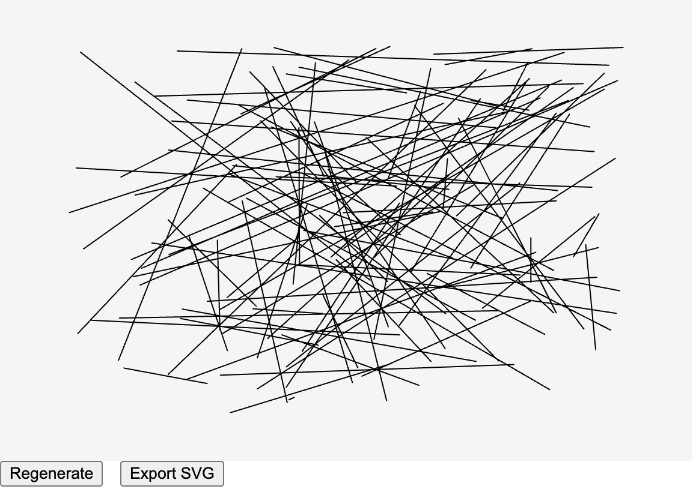

# plotSvg_generative Example



The `plotSvg_generative` example shows one way that p5.plotSvg could be used for generative plotter art. In this sketch, pressing the `Regenerate` button changes the random seed; the user can then press the `Export SVG` button when they like the results.


```
// Demonstrates how to use the p5.plotSvg library to export 
// SVG files from a "generative art" sketch in p5.js.

// This line of code disables the p5.js "Friendly Error System" (FES), 
// to prevent some distracting warnings. Feel free to comment this out.
p5.disableFriendlyErrors = true; 

let bDoExportSvg = false; 
let myRandomSeed = 12345;
let regenerateButton; 
let exportSvgButton; 

//------------------------------------------------------------
function setup() {
  createCanvas(576, 384); // 6"x4" at 96 dpi
  
  regenerateButton = createButton('Regenerate');
  regenerateButton.position(0, height);
  regenerateButton.mousePressed(regenerate);
  
  exportSvgButton = createButton('Export SVG');
  exportSvgButton.position(100, height);
  exportSvgButton.mousePressed(initiateSvgExport);
}

//------------------------------------------------------------
function regenerate(){
  myRandomSeed = round(millis()); 
}
function initiateSvgExport(){
  bDoExportSvg = true; 
}

//------------------------------------------------------------
function draw(){
  randomSeed(myRandomSeed); 
  background(245); 
  strokeWeight(1);
  stroke(0);
  noFill();
  
  if (bDoExportSvg){
    beginRecordSVG(this, "plotSvg_generative_" + myRandomSeed + ".svg");
  }

  // Draw 100 random lines.
  let nLines = 100; 
  for (let i=0; i<nLines; i++){
    let x1 = width  * random(0.1, 0.9); 
    let y1 = height * random(0.1, 0.9); 
    let x2 = width  * random(0.1, 0.9); 
    let y2 = height * random(0.1, 0.9); 
    line (x1,y1, x2,y2); 
  }

  if (bDoExportSvg){
    endRecordSVG();
    bDoExportSvg = false;
  }
}
```
