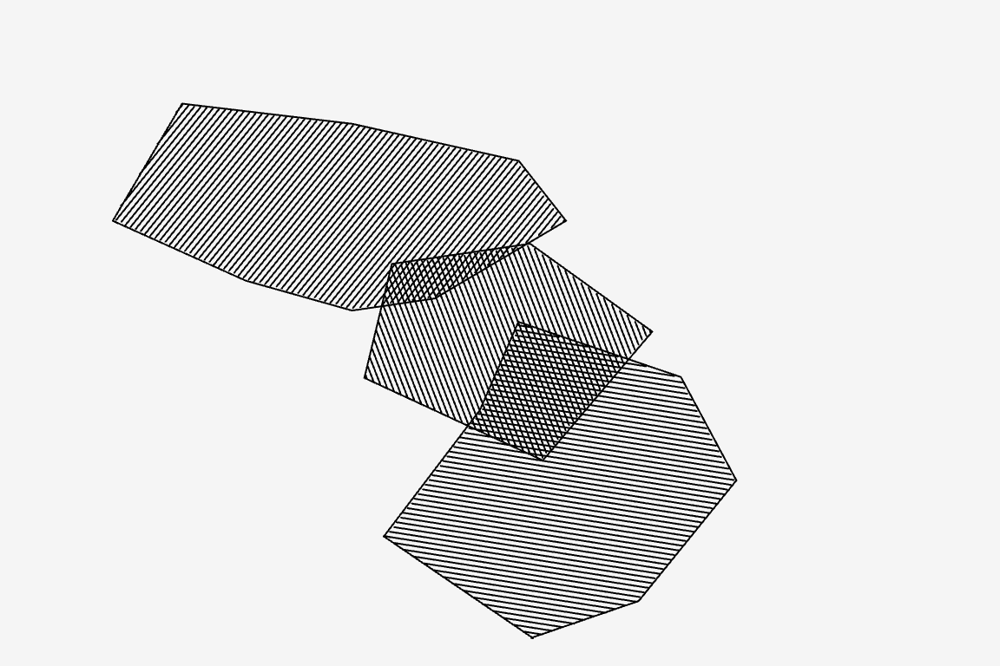

# plotSvg_hatched_shapes Example 

The `plotSvg_hatched_shapes` example presents a hack for hatching SVG shapes, i.e. approximating a simple "fill" using a pen plotter. The hatching method allows for both concave and convex shapes. For more ideas about how to "fill" (hatch) shapes for a pen-plotter, consider [these notes](https://github.com/golanlevin/DrawingWithMachines/blob/main/assignments/05_tone/README.md).

**Note**: this method uses pixel analysis to implement the hatching, and is resolution-dependent. The method works by tracing scanlines in an offscreen buffer. To make the hatching denser or sparser, change the integer variable `HATCH_INTERVAL`. 



Code: 

* At editor.p5js.org: [https://editor.p5js.org/golan/sketches/b75oVci5f](https://editor.p5js.org/golan/sketches/b75oVci5f)
* At openprocessing.org: [https://openprocessing.org/sketch/2479519](https://openprocessing.org/sketch/2479519)
* At GitHub: [sketch.js](https://raw.githubusercontent.com/golanlevin/p5.plotSvg/refs/heads/main/examples/plotSvg_hatched_shapes/sketch.js)

```js
// plotSvg_hatched_shapes Hatched Shapes Example
// Requires https://cdn.jsdelivr.net/npm/p5.plotsvg@latest/lib/p5.plotSvg.js
// Golan Levin, December 2024
//
// This sketch presents a hack for hatching SVG shapes.
// Note: This method uses pixel analysis and is resolution-dependent. 
//
// Click mouse or press ' ' to get a new composition
// Press 'd' to toggle debug view. 
// Press 's' to export SVG.

let bDoExportSvg = false;
let bShowDebug = false; 

let HATCH_INTERVAL = 3; // the hatch spacing. Must be an integer. 
let HATCH_ANGLE = 0;

let W, H; 
let shapes = [];
let hatchBuffer;
let hatchLines;
let exportCount = 0;

p5.disableFriendlyErrors = true;
//======================================
function setup() {
  createCanvas(6 * 96, 4 * 96); // Postcard, 6"x4" @96dpi
  W = width;
  H = height; 
  hatchBuffer = createGraphics(W*2, H*2, P2D);
  hatchBuffer.pixelDensity(1);
  hatchLines = [];
  makeThreeNewShapes(); 
  
  // Set values for our SVG export: 
  setSvgCoordinatePrecision(4); 
  setSvgIndent(SVG_INDENT_SPACES, 2); 
  setSvgDefaultStrokeColor('black'); 
  setSvgDefaultStrokeWeight(1);
}


//======================================
function makeFilledShape() {
  // Note: shapes must not overlap edge of canvas
  // or else significant extra effort must be made.
  let pointsX = [];
  let pointsY = [];
  let nPts = int(round(random(5, 8)));
  
  let cx = random(0.25, 0.75) * W;
  let cy = random(0.25, 0.75) * H;
  for (let i = 0; i < nPts; i++) {
    let t = map(i, 0, nPts, 0, TWO_PI);
    let rx = random(0.10, 0.25) * W;
    let ry = random(0.10, 0.25) * H;
    let px = cx + rx * cos(t);
    let py = cy + ry * sin(t);
    pointsX[i] = px;
    pointsY[i] = py;
  }
  shapes.push([pointsX, pointsY]);
}


//======================================
function makeThreeNewShapes(){
  shapes = [];
  makeFilledShape();
  makeFilledShape();
  makeFilledShape();
}


//======================================
function draw() {
  background(245);

  if (bDoExportSvg) {
    let svgFilename = "plotSvg_hatched_shapes" + nf(exportCount,3) + ".svg";
    beginRecordSVG(this, svgFilename);
    exportCount++; 
  }
  
  stroke(0); 
  drawShapeOutlines(); 
  drawShapeHatchlines();

  if (bDoExportSvg) {
    endRecordSVG();
    bDoExportSvg = false;
  } 
}


//======================================
function drawShapeOutlines(){
  for (let s = 0; s < shapes.length; s++) {
    let pointsX = shapes[s][0];
    let pointsY = shapes[s][1];

    noFill();
    stroke(0);
    beginShape();
    for (let i = 0; i < pointsX.length; i++) {
      let px = pointsX[i];
      let py = pointsY[i];
      vertex(px, py);
    }
    endShape(CLOSE);
  }
}


//======================================
function drawShapeHatchlines(){
  for (let s=0; s<shapes.length; s++){
    HATCH_ANGLE = mouseX/width + s*radians(60);
    computeHatchedShape(s); 
    for (let i=0; i<hatchLines.length; i+=2) {   
      let x1 = hatchLines[i].x; 
      let y1 = hatchLines[i].y; 
      let x2 = hatchLines[i+1].x; 
      let y2 = hatchLines[i+1].y; 
      line(x1,y1, x2,y2);
    }
    
    if (bShowDebug){
      // Display the hatching buffers
      push(); 
      scale(1/8); 
      translate(s + s*hatchBuffer.width,0);
      image(hatchBuffer,0,0); 
      pop(); 
    }
  }  
}


//======================================
function computeHatchedShape(s) {
  const cx = hatchBuffer.width / 2;
  const cy = hatchBuffer.height / 2;
  const hbh = hatchBuffer.height;
  const hbw = hatchBuffer.width;

  // 1. Draw a rotated version of the input 
  // graphics into the offscreen buffer.
  // Shapes to be hatched should be drawn as 
  // white shapes on a black background.
  let pointsX = shapes[s][0];
  let pointsY = shapes[s][1];
  if (pointsX.length >= 3) {
    hatchBuffer.background(0, 0, 0);
    hatchBuffer.fill(255);
    hatchBuffer.noStroke();
    hatchBuffer.push();
    hatchBuffer.translate(cx, cy);
    hatchBuffer.rotate(HATCH_ANGLE);
    hatchBuffer.translate(-cx, -cy);

    hatchBuffer.push(); 
    hatchBuffer.translate(W/2, H/2); 
    hatchBuffer.beginShape();
    for (let i=0; i<pointsX.length; i++){
      hatchBuffer.vertex(pointsX[i], pointsY[i]);
    }
    hatchBuffer.endShape(CLOSE);
    hatchBuffer.pop();
    hatchBuffer.pop();
  }

  
  // 2. Compute hatch lines in the rotated graphics.
  hatchLines = [];
  hatchBuffer.loadPixels();
  for (let y = 0; y < hbh; y += HATCH_INTERVAL) {
    let row = y * hbw;
    let bActive = false;
    let prevR = 0;
    for (let x = 0; x < hbw; x++) {
      let index = (row + x) * 4;
      let currR = hatchBuffer.pixels[index]; // red byte
      if (x == hbw - 1) {
        if (bActive) {
          hatchLines.push(createVector(x, y)); // line end
          bActive = false;
        }
      } else {
        if (currR >= 128 && prevR < 128) {
          hatchLines.push(createVector(x + 1, y)); // line start
          bActive = true;
        } else if (currR < 128 && prevR >= 128 && bActive) {
          hatchLines.push(createVector(x - 1, y)); // line end
          bActive = false;
        }
      }
      prevR = currR;
    }
  }

  // 3. Un-rotate the hatch lines.
  for (let i = 0; i < hatchLines.length; i += 2) {
    let st = hatchLines[i]; // start
    let en = hatchLines[i+1]; // end
    let sxo = st.x - cx;
    let syo = st.y - cy;
    let sxr = sxo * Math.cos(-HATCH_ANGLE) - syo * Math.sin(-HATCH_ANGLE) + cx;
    let syr = syo * Math.cos(-HATCH_ANGLE) + sxo * Math.sin(-HATCH_ANGLE) + cy;
    let exo = en.x - cx;
    let eyo = en.y - cy;
    let exr = exo * Math.cos(-HATCH_ANGLE) - eyo * Math.sin(-HATCH_ANGLE) + cx;
    let eyr = eyo * Math.cos(-HATCH_ANGLE) + exo * Math.sin(-HATCH_ANGLE) + cy;
    hatchLines[i].set(sxr, syr);
    hatchLines[i+1].set(exr, eyr);
  }
  for (let i = 0; i < hatchLines.length; i++) {
    let px =  hatchLines[i].x - W/2;
    let py =  hatchLines[i].y - H/2;
    hatchLines[i].set(px, py);
  }
}


//======================================
function mousePressed(){
  makeThreeNewShapes(); 
}
function keyPressed() {
  if (key == " ") {
    makeThreeNewShapes(); 
  } else if (key == "s") {
    bDoExportSvg = true;
    save(); // also save a PNG
  } else if (key == "d") {
    bShowDebug = !bShowDebug;
  }
}
```
