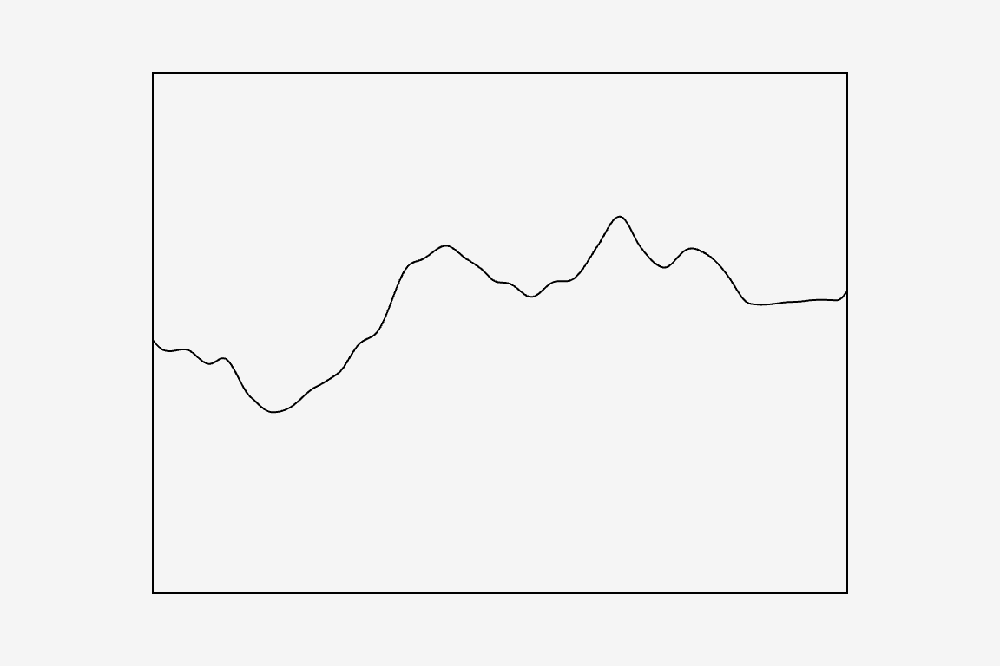

# plotSvg_hello_animating Example

The `plotSvg_hello_animating ` example shows basic use of the p5.plotSvg library, for a p5.js sketch in the familiar "animating/looping" mode, which uses both `setup()` and `draw()` functions. Note that the global boolean variable `bDoExportSvg` is used as a latch to export an SVG file only when the user presses the `s` key. 



Code: 

* At editor.p5js.org: [https://editor.p5js.org/golan/sketches/JA-ty5j83](https://editor.p5js.org/golan/sketches/JA-ty5j83)
* At openprocessing.org: [https://openprocessing.org/sketch/2455390](https://openprocessing.org/sketch/2455390)
* At Github: [sketch.js](https://raw.githubusercontent.com/golanlevin/p5.plotSvg/refs/heads/main/examples/plotSvg_hello_animating/sketch.js)


```
// plotSvg_hello_animating Example
// This sketch demonstrates how to use the p5.plotSvg library 
// to export SVG files during interaction. Press 's' to export an SVG. 

// This line of code disables the p5.js "Friendly Error System" (FES), 
// in order to prevent several distracting warnings:
p5.disableFriendlyErrors = true; 

let bDoExportSvg = false; 
function setup() {
  // Postcard size: 6"x4" at 96 dpi
  createCanvas(576, 384); 
}

function keyPressed(){
  if (key == 's'){
    // Initiate SVG exporting
    bDoExportSvg = true; 
  }
}

function draw(){
  background(245); 
  strokeWeight(1);
  stroke(0);
  noFill();
  
  if (bDoExportSvg){
    // Begin exporting, if requested
    beginRecordSVG(this, "plotSvg_hello_animating.svg");
  }

  
  // Draw your artwork here.
  push(); 
  translate(width/2, height/2); 
  beginShape(); 
  for (let i=0; i<=400; i++){
    let val = noise(i/100 + millis()/1000) - 0.5; 
    vertex(i-200, 200*val); 
  }
  endShape(); 
  rectMode(CENTER); 
  rect(0,0, 400,300); 
  pop(); 
  

  if (bDoExportSvg){
    // End exporting, if doing so
    endRecordSVG();
    bDoExportSvg = false;
  }
}
```
