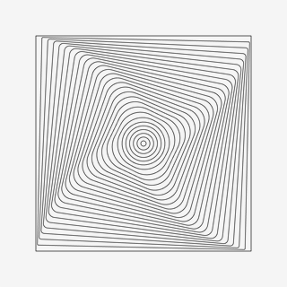

# plotSvg_instancemode Example

The `plotSvg_instancemode` example demonstrates the use of p5.plotSvg in p5's [instance mode](https://github.com/processing/p5.js/wiki/Global-and-instance-mode). The implementation of this functionality is thanks to the contribution of Lionel Ringenbach ([@ucodia](https://github.com/ucodia)).

p5.js offers two primary modes of operation:

* **Global mode:** p5.js functions are available globally (e.g., `circle()`, `line()`).
* **Instance mode:** p5.js functions are methods of a specific p5 instance (e.g., `p.circle()`, `p.line()`).

Instance mode is necessary for:

* Applications that require multiple sketches on a single page.
* Integration in modern web applications which use a JavaScript bundler (for example, React).

## Limitation

The same import of `p5plot` should not be used for different instances; sketches should import it in a separate JavaScript module.


## Minimal instance mode example

This is a complete p5 sketch showing the use of p5.plotSvg in instance mode:

```js
import p5plot from 'p5.plotsvg';

function sketch(context) {
  context.setup = function() {
    context.createCanvas(400, 400);    
    p5plot.beginRecordSVG(context, "output.svg");
    context.circle(200, 200, 200);
    p5plot.endRecordSVG();
  };
};

new p5(sketch, document.getElementById("container"));
```

## Elaborated instance mode example



Code: 

* At editor.p5js.org: [https://editor.p5js.org/golan/sketches/Ib_myDs3s](https://editor.p5js.org/golan/sketches/Ib_myDs3s)
* At Github: [sketch.js](https://raw.githubusercontent.com/golanlevin/p5.plotSvg/refs/heads/main/examples/plotSvg_instancemode/sketch.js)


```js
// plotSvg_instancemode example
// (squircle for plotters)
// by lionel ringenbach - @ucodia
// 26.02.2025

function squircle(sketch) {
  let exportSvg = false;
  let seed = 12345;
  let regenerateButton;
  let exportSvgButton;

  sketch.setup = function () {
    sketch.createCanvas(576, 576); // 6"x6" at 96 dpi

    regenerateButton = sketch.createButton("Regenerate");
    regenerateButton.position(0, sketch.height);
    regenerateButton.mousePressed(regenerate);

    exportSvgButton = sketch.createButton("Export SVG");
    exportSvgButton.position(100, sketch.height);
    exportSvgButton.mousePressed(initiateSvgExport);
  };

  function regenerate() {
    seed = sketch.round(sketch.millis());
  }

  function initiateSvgExport() {
    exportSvg = true;
  }

  sketch.draw = function () {
    sketch.rectMode(sketch.CENTER);
    sketch.randomSeed(seed);
    sketch.background(255);
    sketch.strokeWeight(1);
    sketch.stroke(0);
    sketch.noFill();

    if (exportSvg) {
      beginRecordSVG(sketch, "plotSvg_instancemode_" + seed + ".svg");
    }

    // pick random line number and rotation increment
    let nLines = sketch.random(10, 100);
    let rotInc = sketch.random() < 0.5 ? sketch.random(-0.1, 0.1) : 0;

    let maxW = sketch.width * 0.75;
    let minW = sketch.width * 0.01;
    let wInc = (maxW - minW) / nLines;

    for (let i = 0; i < nLines; i++) {
      let rot = rotInc * i;
      let r = sketch.map(i, 0, nLines - 1, 0, sketch.width * 0.1);
      let w = maxW - i * wInc;

      sketch.push();
      sketch.translate(sketch.width / 2, sketch.height / 2);
      sketch.rotate(rot);
      sketch.translate(-sketch.width / 2, -sketch.height / 2);
      sketch.rect(sketch.width / 2, sketch.height / 2, w, w, r);
      sketch.pop();
    }

    if (exportSvg) {
      endRecordSVG();
      exportSvg = false;
    }
  };
}

new p5(squircle);
```
