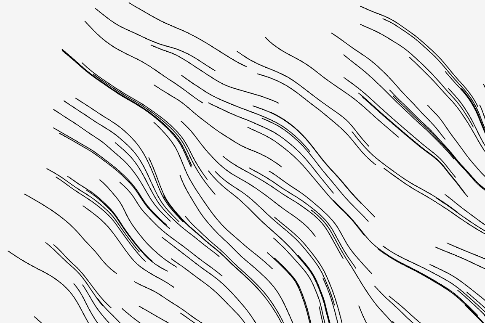

# plotSvg_particle_paths Example

The `plotSvg_particle_paths ` example accumulates the positions of 100 particles as they move over time, and exports these traces as an SVG after 100 frames. (Particles are influenced by a Perlin Noise flow field.) 



Code: 

* At editor.p5js.org: [https://editor.p5js.org/golan/sketches/1Toe-pMZH](https://editor.p5js.org/golan/sketches/1Toe-pMZH)
* At openprocessing.org: [https://openprocessing.org/sketch/2478945](https://openprocessing.org/sketch/2478945)
* At Github: [sketch.js](https://raw.githubusercontent.com/golanlevin/p5.plotSvg/refs/heads/main/examples/plotSvg_particle_paths/sketch.js)


```
// https://github.com/golanlevin/p5.plotSvg (v.0.1.x)
// A Plotter-Oriented SVG Exporter for p5.js
// Golan Levin, November 2024
//
// Accumulates the positions of 100 particles as they move over time.
// (Particles are influenced by a Perlin Noise flow field.) 
// Exports these traces as an SVG after 100 frames.
// 
// Requires: https://cdn.jsdelivr.net/npm/p5.plotsvg@latest/lib/p5.plotSvg.js
// See: https://github.com/golanlevin/p5.plotSvg
p5.disableFriendlyErrors = true; 

let bDoExportSvg = false; 
let nParticles = 100; 
let nRecordingFrames = 100; 
let particles = []; // current positions of the particles
let particleHistories = []; // traces left by each particle

function setup() {
  // Postcard size: 6"x4" at 96 dpi
  createCanvas(576, 384);
  setSvgCoordinatePrecision(2); // keep file size small
  
  for (let i=0; i<nParticles; i++){
    let rx = random(0,width); 
    let ry = random(0,height); 
    particles.push(createVector(rx,ry)); 
    
    let ithParticleHistory = [];
    ithParticleHistory.push(createVector(rx,ry)); 
    particleHistories.push(ithParticleHistory); 
  }
}


function draw(){
  background(245);
  
  // Update the particle locations
  if (frameCount < nRecordingFrames){
    for (let i=0; i<particles.length; i++){
      let currx = particles[i].x; 
      let curry = particles[i].y; 
      let dx = 3.0 * noise(currx/100, curry/100, 123); 
      let dy = 3.0 * noise(currx/100, curry/100, 345);
      let nextx = currx + dx; 
      let nexty = curry + dy; 
      particles[i].x = nextx;
      particles[i].y = nexty;
      particleHistories[i].push(createVector(nextx,nexty)); 
    }
  } else if (frameCount == nRecordingFrames) {
    // Initiate SVG output
    bDoExportSvg = true; 
    beginRecordSVG(this, "plotSvg_particle_paths.svg");
  }
  
  // Draw each of the particle histories
  strokeWeight(1);
  stroke(0);
  noFill();
  for (let i=0; i<particleHistories.length; i++){
    beginShape(); 
    for (let j=0; j<particleHistories[i].length; j++){
      let px = particleHistories[i][j].x;
      let py = particleHistories[i][j].y;
      vertex(px,py); 
    }
    endShape(); 
  }
  
  if (bDoExportSvg){
    // Terminate SVG output
    endRecordSVG();
    bDoExportSvg = false;
  }
}
```