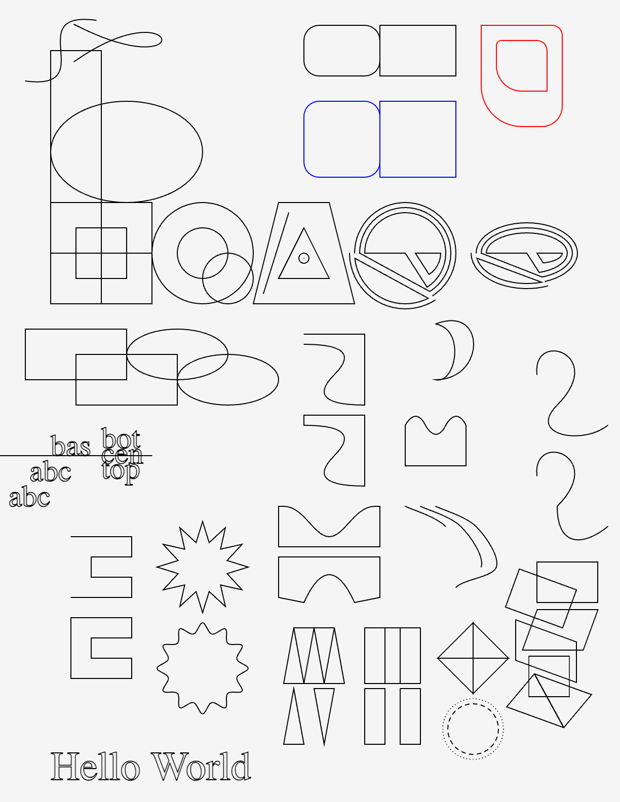

# plotSvg_smorgasbord Example

The `plotSvg_smorgasbord` example is intended as a comprehensive test, to ensure that all path-based p5.js drawing commands are successfully exporting vector paths to an SVG file. 

### Code: 

* At editor.p5js.org: [https://editor.p5js.org/golan/sketches/QReF_9ss2](https://editor.p5js.org/golan/sketches/QReF_9ss2)
* At openprocessing.org: [https://openprocessing.org/sketch/2455426](https://openprocessing.org/sketch/2455426)
* At Github: [sketch.js](https://raw.githubusercontent.com/golanlevin/p5.plotSvg/refs/heads/main/examples/plotSvg_smorgasbord/sketch.js)

`plotSvg_smorgasbord` 
includes tests of the following p5.js drawing commands and options: 

* `arc()` — `OPEN, CHORD, PIE`
* `bezier()`
* `circle()`
* `curve()`
* `ellipse()`
* `line()`
* `point()`
* `quad()`
* `rect()`
* `square()`
* `stroke()`
* `text()`
* `triangle()`
* `beginShape()` — `TRIANGLE_STRIP, TRIANGLES, QUAD_STRIP, QUADS, TRIANGLE_FAN, POINTS, LINES`
* `vertex()`, `quadraticVertex()`, `bezierVertex()`, `curveVertex()`¹
* `endShape()` — `CLOSE`

In addition, this example also tests the following drawing-state modifiers:

* `stroke()`
* `curveTightness()`
* `ellipseMode()` — `CORNER, CORNERS, CENTER, RADIUS`
* `rectMode()` — `CORNER, CORNERS, CENTER, RADIUS`
* `push()`, `pop()`
* `translate()`, `rotate()`, `scale()`, `shearX()`, `shearY()`
* `textSize()`
* `textFont()`
* `textStyle()`
* `textAlign()`²

---

### Known Issues and Bugs: 

1. In p5.plotSvg v.0.1.x, there is a small discrepancy in the SVG output of polylines rendered with curveVertex(). Specifically, there is an error with the starting orientation of the first point of the polyline.
2. In p5.plotSvg v.0.1.x, non-default vertical `textAlign()` settings are not yet supported; only BASELINE currently works correctly.
3. In p5.plotSvg v.0.1.x, *multi-contour* shapes (made with `beginContour()` / `endContour()`etc.) are not yet unsupported. For the time being, encode each contour in its own `beginShape()` / `endShape()` block instead. 

